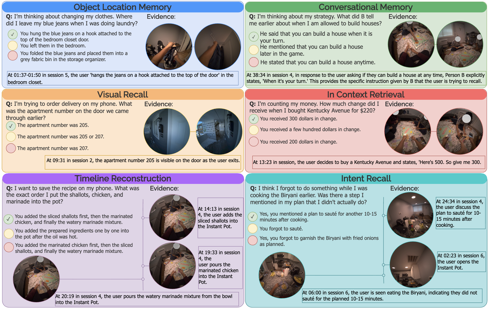

# SuperMemory-VQA: An Egocentric Visual Question-Answering Benchmark for Long-Horizon Memory


## Overview

SuperMemory-VQA is an egocentric visual question-answering benchmark designed to evaluate AI agents as personalized memory assistants on AR glasses. Unlike existing egocentric datasets that focus on action recognition or short-clip perception, SuperMemory-VQA targets practical, long-horizon memory tasks that mirror the gaps humans actually experience in everyday life.

The dataset contains **52.9 hours** of everyday activities recorded with AR glasses and **4,853** human-verified question-answer pairs spanning six realistic memory skills. Each question is multiple-choice with an explicit *unanswerable* option to test hallucination robustness.

## Key Features

SuperMemory-VQA advances four dimensions over prior egocentric QA benchmarks:

1. **Comprehensive memory tasks.** Six user-evaluated, commonly encountered memory skills covering conversational memory, in-context retrieval, intent recall, object-location memory, timeline reconstruction, and visual recall.
2. **Long-horizon context.** Recordings are collected over days and weeks rather than minutes, requiring evidence to be retrieved across temporally distant sessions.
3. **Multi-evidence reasoning.** Questions require retrieving and reasoning across multiple parts of a recording rather than answering from a single clip.
4. **Realistic question phrasing.** Questions and answers use natural, context-grounded language instead of rigid templates.

## Data Modalities

Each recording session includes synchronized:
- RGB video
- Audio transcription
- Eye gaze
- IMU
- SLAM trajectories

## Task Categories

<div align="center">
 <br>
</div>


## Benchmark Results

We evaluate leading open- and closed-source vision-language models under two agentic frameworks, **Video-RAG** and **EgoButler**. Best score in each framework–metric column is shown in **bold**.

| Model | Video-RAG Ans-F1 | Video-RAG Acc. | Video-RAG MRR | EgoButler Ans-F1 | EgoButler Acc. | EgoButler MRR |
|---|---|---|---|---|---|---|
| *Open-source models* | | | | | | |
| Qwen-3-VL 8B | 75.0 | 41.8 | 63.8 | 44.5 | 38.8 | 61.0 |
| Qwen-3-VL 30B | 56.6 | 45.5 | 65.7 | 44.2 | 39.1 | 61.8 |
| InternVL-3.5 8B | 81.7 | 41.0 | 63.3 | 61.4 | 39.8 | 61.8 |
| InternVL-3.5 30B | 77.7 | 42.3 | 63.7 | 28.5 | 27.3 | 53.4 |
| Gemma-4-E4B IT | 40.3 | 35.3 | 58.2 | 30.9 | 36.4 | 58.2 |
| Gemma-4 31B | 67.2 | 45.6 | 65.5 | 43.9 | 41.5 | 62.2 |
| *Closed-source models* | | | | | | |
| Gemini-3-Flash | **83.9** | **61.0** | **76.0** | 71.2 | **54.1** | **71.6** |
| Gemini-3.1-Pro | 67.4 | 53.2 | 70.7 | 43.5 | 42.6 | 64.2 |
| GPT-5.4-mini | 77.6 | 47.8 | 67.4 | **75.0** | 46.0 | 66.1 |
| GPT-5.4 | 78.3 | 52.3 | 69.5 | 71.7 | 48.0 | 67.2 |

Even the strongest systems remain far from reliable on real-world memory tasks, indicating substantial headroom for new architectures that ground answers in retrieved evidence and abstain when evidence is insufficient.


## Citation

```bibtex
@inproceedings{alam2026supermemoryvqa,
  title     = {SuperMemory-VQA: An Egocentric Visual Question-Answering Benchmark for Long-Horizon Memory},
  author    = {Alam, Samiul and Siam, Shakhrul Iman and Proulx, Michael J. and Fort, James and Newcombe, Richard and Kim, Hyo Jin and Zhang, Mi},
  year      = {2026}
}
```